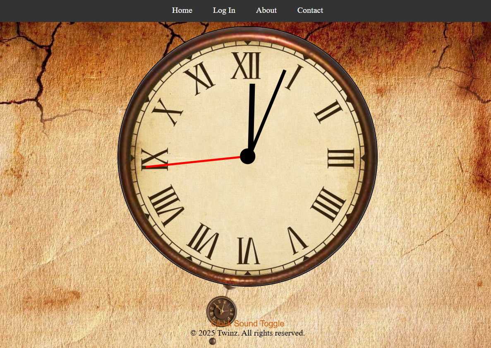

# 🕒 Analog Clock

A clean and responsive **Analog Clock** built with **HTML**, **CSS**, and **JavaScript**.



---

## 🚀 Features
- Real-time analog clock  
- Smooth hand movement  
- Responsive & lightweight  
- Simple UI

## 🛠️ Tech Stack
- HTML5  
- CSS3  
- JavaScript (Vanilla)

## 📁 Structure
Analog-Clock/ ├── index.html ├── style.css └── script.js

## Go and Run it 
with liveserver

## ✨ Usage
```git clone https://github.com/YALDAKHOSHPEY/Analog-Clock.git```


Open index.html in your browser and enjoy!
##💡 Improvements

Dark/Light mode toggle
Digital time display
Canvas/SVG rendering
Time zone support

##🙌 Author
Made with ❤️ by Yalda Khoshpey (https://github.com/YALDAKHOSHPEY)
📄 License
Open-source under the MIT License
